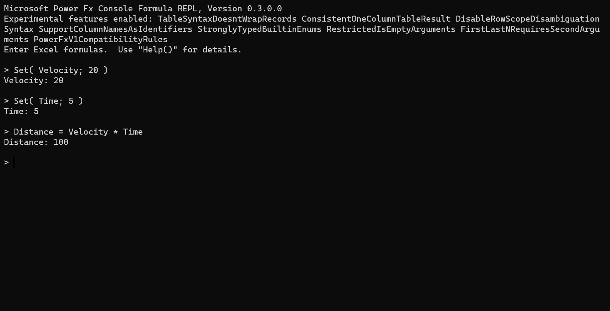

# Chapter 3 Power Fx overview and usage in testing
## Code companion

This folder contains code and samples presented in chapter 3 "Power Fx overview and usage in testing".

You can use any Pwoer Apps environment to test Power FX, but as Power Fx is an open source engine, you could test examples that does not connect to a Power Platform environment through host using the command line. There is examples of these hosts in the [Power Fx host samples](https://github.com/microsoft/power-fx-host-samples)

The [Console REPL](https://github.com/microsoft/Power-Fx/tree/main/src/tools/Repl) will be used, from the latest version of [Power Fx](https://github.com/microsoft/Power-Fx), and a compiled version could be downloaded from this chapter repo.

You can see an example fo the first sample
Just download and extract the [compiled version of REPL](REPL.zip.001) (2 files 001 / 002) and copy and paste the files for each sample (files ending .fx)

[sample01.fx](sample01.fx)
``` Power Fx
Set( Velocity; 20 )
Set( Time; 5 )
Distance = Velocity * Time
```


