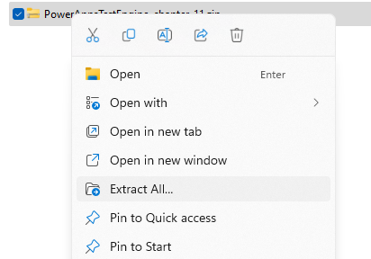
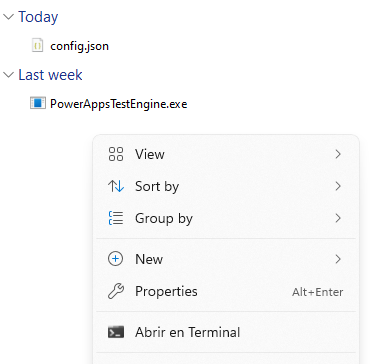
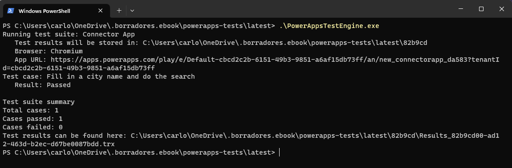

# Chapter 11 Mocks with Test Engine
## Code companion

This folder contains code and samples presented in chapter 11 "Mocks with test Engine". For simplicity, the release from this fork [https://github.com/carloshm/PowerApps-TestEngine/](https://github.com/carloshm/PowerApps-TestEngine/tree/1.0.5-preview-mocks) is used, with changes presented in the chapter.

1.- [Test Engine fork for additional mock routing](PowerAppsTestEngine_chapter_11.zip)

2.- [Mock samples files](mock-samples.zip)

3.- [Sample Power Apps app for tests](PowerParse_20230702205914.zip)

### Setup Power Apps environment
Chapter 5 guides you in the first step to provision a trial or developer tenant so you can deploy and test the examples. In a nutshell:
- Set up a trial or developer tenant to follow the instructions
- Deploy samples app called Power Parse to your environment
- Check Mock samples to be used with the Power Parse sample app

### Steps to use chapter 11 files
Chapter 11 presents additional mock routing options not presented in the 1.0.5-preview version of Test Engine. This fork available from the release of [Test Engine 1.0.5-preview-mock](https://github.com/carloshm/PowerApps-TestEngine/tree/1.0.5-preview-mocks) is used in the examples.
You can use the zip files in a windows system. For Linux compile or run from source code.
For windows:
- Download and extract the zip file contents in a folder

- Set up the [config file](https://github.com/microsoft/PowerApps-TestEngine#2-set-up-the-config-file) with the data from your environment
- Open a PowerShell terminal from the file directory

- Execute and confirm results

